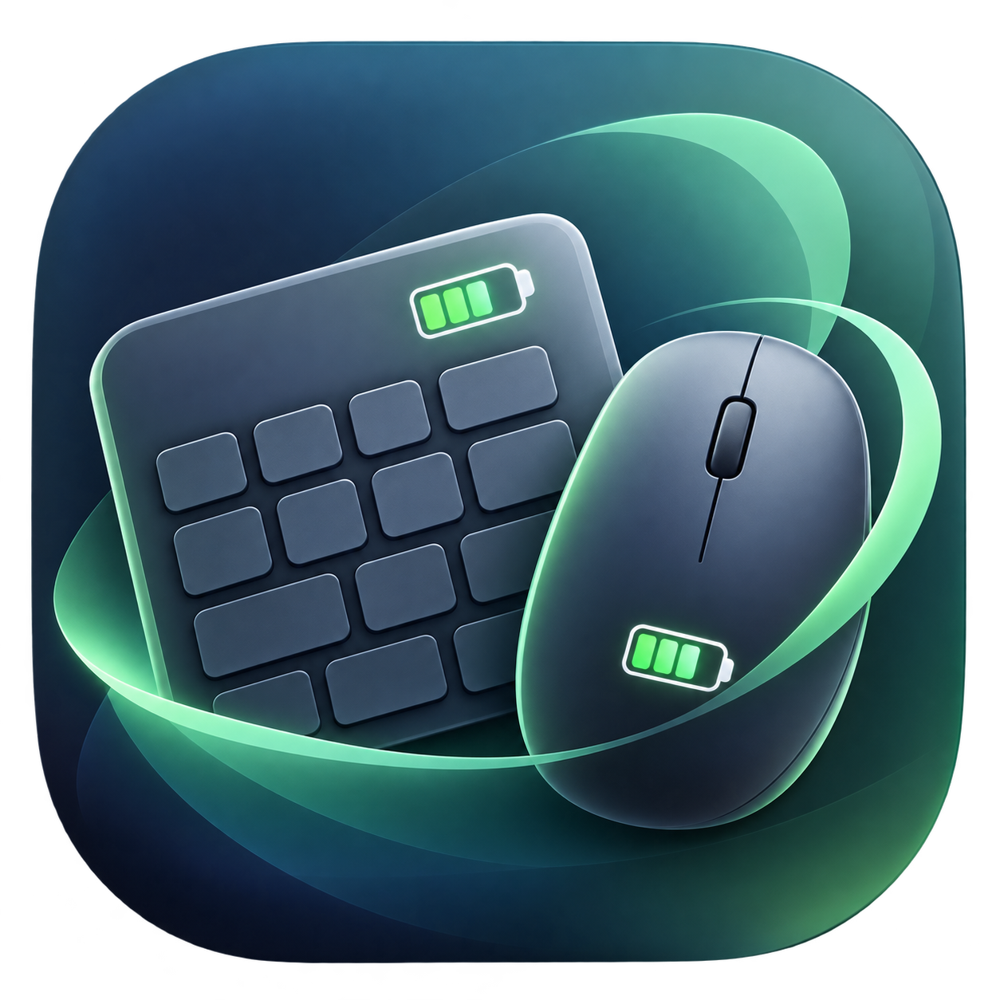
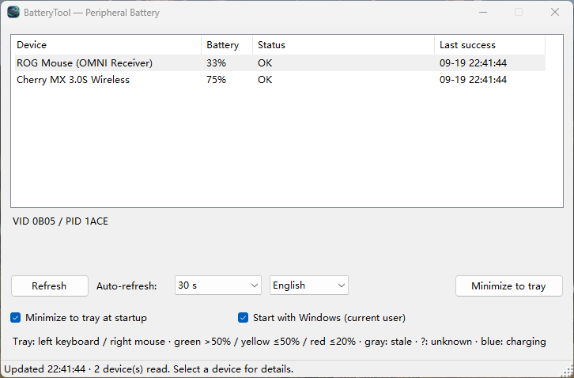
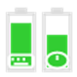
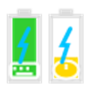
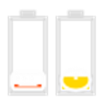
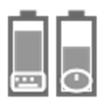
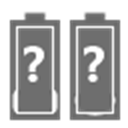
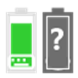

<p align="right"><strong>English</strong> · <a href="./README.zh-CN.md">简体中文</a></p>

<p align="center">
  
</p>

# BatteryTool

Windows tray utility for **Cherry keyboard** and **ROG mouse** battery levels. It only sends HID battery queries — no lighting, DPI, pairing, or power-profile writes.

<!-- If the GitHub path is not 1gcat/BatteryTool, replace that slug in the badge / star-history URLs. -->
[](LICENSE)
[](https://dotnet.microsoft.com)
[](https://github.com/1gcat/BatteryTool)
[](https://github.com/1gcat/BatteryTool/stargazers)
[](https://github.com/1gcat/BatteryTool/issues)
[](https://github.com/1gcat/BatteryTool/commits)

## Demo

<p align="center">
  
</p>

## Tray icon

One icon, two devices: **left = keyboard**, **right = mouse**. Green &gt;50%, yellow ≤50%, red ≤20%, gray = stale, `?` = unknown, blue bolt = charging.

| Normal | Charging | Low |
| :---: | :---: | :---: |
|  |  |  |
| 87% / 66% | charging | ≤20% |

| Stale | Unknown | Keyboard only |
| :---: | :---: | :---: |
|  |  |  |
| last good reading | disconnected | mouse missing |

## Features

- Auto-refresh, start minimized, per-user Windows logon autostart
- Keeps the last good reading when a device is asleep or briefly missing
- Chinese / English UI; first launch follows the OS language

## Supported devices

### Cherry keyboards

VID `046A`, Col04 channel.

- Cherry MX 2.0S (`01AC`)
- Cherry MX 3.0S Wireless (`00EA`)

### ROG mice

VID `0B05`. USB receiver or cable; Bluetooth is not supported.

- ROG Mouse (OMNI Receiver)
- ROG Harpe II
- ROG Harpe II Ace (USB)
- ROG Harpe Ace Aim Lab, Harpe Ace Aim Lab (USB), Harpe Ace Extreme (USB), Harpe Ace Mini (USB)
- ROG Chakram X, Chakram X (USB), Chakram, Chakram (USB)
- ROG Gladius III Wireless, Gladius III (USB), Gladius III Aimpoint, Gladius III Aimpoint (USB), Gladius III EVA-02, Gladius III EVA-02 (USB), Gladius II Wireless
- ROG Keris Aimpoint, Keris Aimpoint (USB), Keris II Ace (USB), Keris Wireless, Keris (USB), Keris EVA, Keris EVA (USB), Keris II Origin (USB), Keris II Origin KJP (USB)
- ROG Spatha X, Spatha X (USB)
- ROG Pugio II, Pugio II (USB)
- ROG Strix Impact II Wireless, Strix Impact II (USB), Strix Carry

## Download

Windows **x64** only (no 32-bit). Get the [latest release](https://github.com/1gcat/BatteryTool/releases/latest); checksums are in `SHA256SUMS.txt`.

| File | Variant | Notes |
| --- | --- | --- |
| `BatteryTool-{ver}-win-x64-framework.zip` | Framework-dependent | Smallest. Requires [.NET 10 Desktop Runtime](https://dotnet.microsoft.com/download/dotnet/10.0) (Windows x64). |
| `BatteryTool-{ver}-win-x64-self-contained.zip` | Self-contained | Includes the runtime. Unzip and run; no extra .NET install. |
| `BatteryTool-{ver}-win-x64.exe` | Single-file | Self-contained one-file build. Download and run. |

## Getting started

### Requirements

- Windows 10 or later, 64-bit
- [.NET 10 SDK](https://dotnet.microsoft.com/download) to build from source
- Framework-dependent releases also need the [.NET 10 Desktop Runtime](https://dotnet.microsoft.com/download/dotnet/10.0)

### Build

```bash
git clone https://github.com/1gcat/BatteryTool.git
cd BatteryTool
dotnet build BatteryTool.slnx -c Release
dotnet run --project BatteryTool.Winform -c Release
```

Protocol smoke checks:

```bash
dotnet run --project BatteryTool.Checks -c Release
```

## Usage

| Action | |
| --- | --- |
| Refresh | Toolbar button, tray menu, or the auto-refresh interval |
| Hide | Minimize, or **Minimize to tray** |
| Restore | Double-click the tray icon, or **Show window** |
| Language | `中文` / `English` combo on the main window |
| Demo (no hardware) | `BatteryTool.Winform --mock` |

Closing the window exits the app. Minimizing keeps monitoring in the tray.

## Configuration

Settings are stored at `%LOCALAPPDATA%\BatteryTool\settings.json` (refresh interval, start minimized, language). Autostart uses the current-user `Run` registry key and does not require administrator rights.

## Acknowledgments

https://github.com/zcmk123/cherry-battery-state  
https://github.com/seerge/g-helper

## License

[GPL-3.0](LICENSE)

## Star History

[](https://star-history.com/#1gcat/BatteryTool&Date)
